# PyCitySchools
## Overview of the school district analysis 
The purpose of this analysis was to aggregate PyCitySchools District data to uncover trends in school performance and funding.  The results of this analysis could help inform district leaders on performance patterns and budgeting allocation. 
Deliverables for the analysis of the school district: 

  * A high-level snapshot of the district's key metrics, presented in a table format
  * An overview of the key metrics for each school, presented in a table format
Tables presenting each of the following metrics:

  * Top 5 and bottom 5 performing schools, based on the overall passing rate
  * The average math score received by students in each grade level at each school
  * The average reading score received by students in each grade level at each school
  * School performance based on the budget per student
  * School performance based on the school size 
  * School performance based on the type of school

## Results 
To uncover trends and patterns through this analysis, student and school data was referenced from csv files provided by the school district.  The aforementioned metrics were filtered and displayed in tables below. After discovering potential tampering with the school district performance data, the 9th grade student scores from Thomas High School (THS) were removed. To investigate the impact of this change, the analysis was calculated again with out the potentially impacted scores. The second set of tables display the analysis results without the potentially contaminated scores from Thomas High School's 9th grade students. 

### District Level Summary: 

The following table displays a high-level snapshot of the district's key metrics.
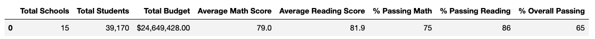

After removing THS 9th grade student scores from the analysis, 
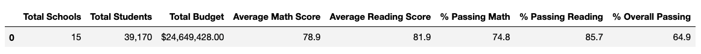

### School Level Summary

Top 5 performing schools, based on the overall passing rate

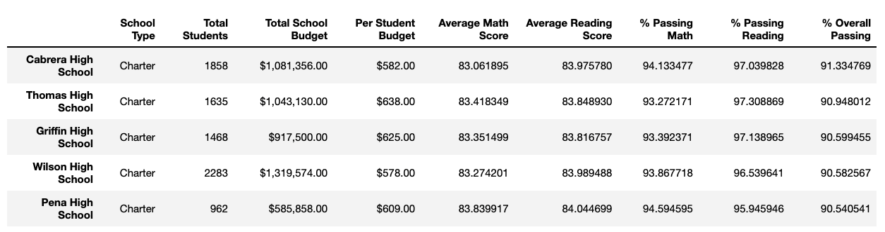

Top 5 performing schools after removing THS 9th grade

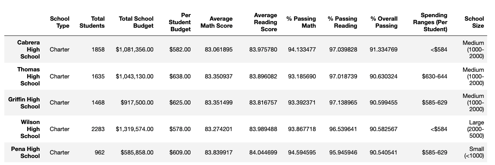

Bottom 5 performing schools, based on the overall passing rate

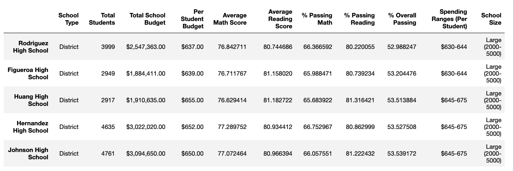

Bottom 5 after removing THS 9th grade

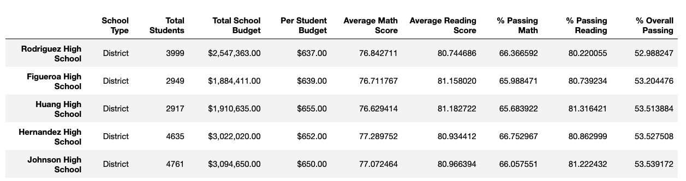

#### Math Scores by Grade Level for each School  
The average math score received by students in each grade level at each school

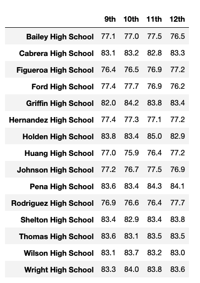

Average math after removing THS 9th grade

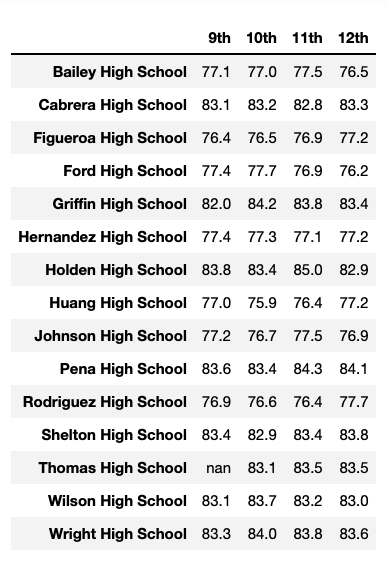

#### Reading Scores by Grade Level for each School  

The average reading score received by students in each grade level at each school

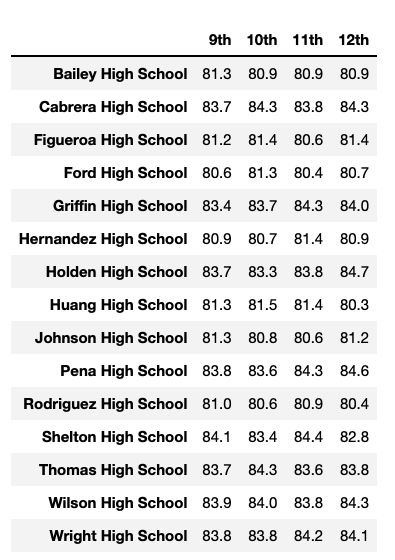

Average reading after removing THS 9th grade

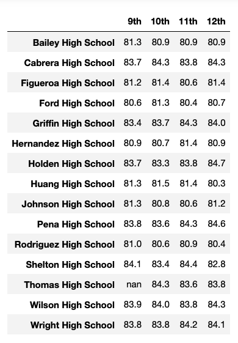

### School performance Summary Based on the Budget per Student

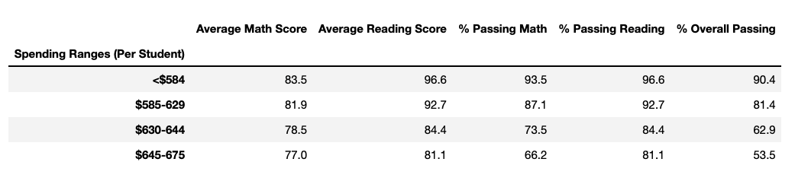

Performance based on budget per student after removing THS 9th grade

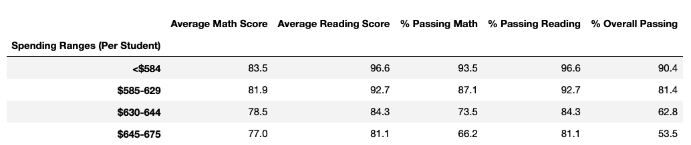

### School performance Summary based on the school size 

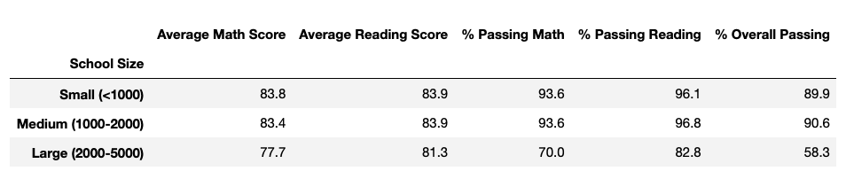

School performance based on the school size after removing THS 9th grade

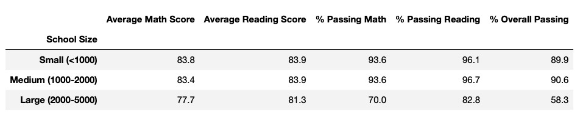

### School performance Summary based on the type of school

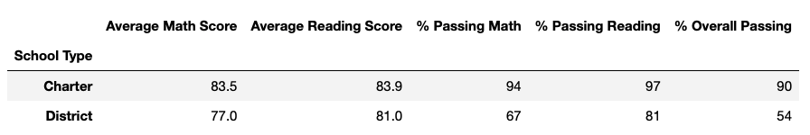

School performance based on the type of school after removing THS 9th grade
  
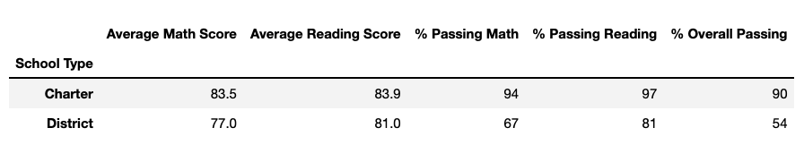

## Analysis
How is the district summary affected?

How is the school summary affected?
How does replacing the ninth graders’ math and reading scores affect Thomas High School’s performance relative to the other schools?

How does replacing the ninth-grade scores affect the following:
Math and reading scores by grade
Scores by school spending
Scores by school size
Scores by school type

## Summary
Summarize four changes in the updated school district analysis after reading and math scores for the ninth grade at Thomas High School have been replaced with NaNs.

